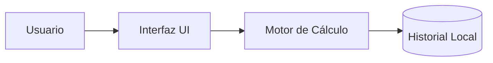

# Calculadora


Una aplicación web interactiva que permite realizar operaciones matemáticas básicas y funciones científicas avanzadas.

## Descripción

Diseñada con una interfaz intuitiva para estudiantes y profesionales que requieren cálculos rápidos en el navegador.

## Tabla de contenidos

- [Descripción](#descripción)
- [Instalación](#instalación)
- [Uso](#uso)
- [Contribuidores](#contribuidores)

## Instalación

```bash
git clone (https://github.com/TU-USUARIO/laboratorio-readme.git)
cd laboratorio-readme
npm install
```

## Estado de funcionalidades

| Función                                      | Estado      |
| -------------------------------------------- | ----------- |
| Operaciones básicas (Suma, Resta, Mult, Div) | Listo       |
| Funciones trigonométricas (Sin, Cos, Tan)    | Listo       |
| Historial de operaciones                     | En progreso |

## Pendientes

- [x] Implementación de interfaz gráfica
- [ ] Soporte para cálculo de matrices
- [ ] Exportación de historial a PDF

## Arquitectura



## Contribuidores

- **Sebastian Mamani** - [@tu-usuario](https://github.com/sebastianmr-eng)
